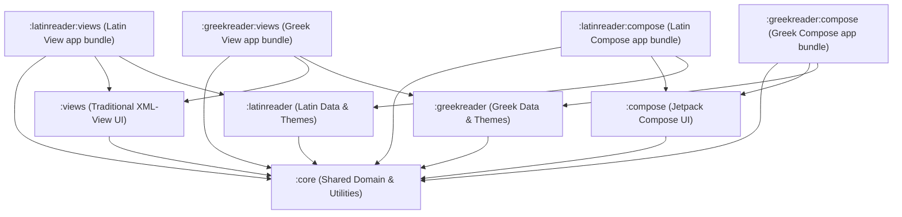

# System Architecture

The Classics Reader Android project is designed around a decoupled, multi-module architecture. It splits business logic, view presentation, Jetpack Compose presentation, language metadata, and final application shells into separate Gradle modules. This setup enables high code reuse and allows compilation of multiple distinct apps (Latin Reader and Greek Reader) in two different UI architectures (legacy XML Views and modern Compose).

## Modularization Overview

The project is structured into nine modules, declared in `settings.gradle`:

```gradle
include ':core'
include ':compose'
include ':views'
include ':latinreader'
include ':greekreader'
include ':greekreader:compose'
include ':greekreader:views'
include ':latinreader:views'
include ':latinreader:compose'
```

### 1. Core Module (`:core`)
* **Type**: Android Library
* **Purpose**: Houses the domain data model, database repositories, settings preference management, XML helper utilities, and abstract interfaces.
* **Key Components**:
  * `MyApplication`: The root application class implementing reflection-based dependency injection.
  * `Book`, `Work`, `WorkInfo`, `Library`, `TOCEntry`: Core domain data structures.
  * `Dictionary`, `DictionaryRepository`: Dictionary abstraction layers.
  * `ResourceHelpers`: Stream reader and XML parser using `XmlPullParser`.
  * `ITextConverter`: Interface for handling character translations (e.g., Greek transliteration).
  * `PreferencesDataStore`: State flow mapping configuration settings.

### 2. Views Presentation Module (`:views`)
* **Type**: Android Library
* **Purpose**: Implementation of the user interface using traditional XML layouts, View Binding/Data Binding, Fragments, and Navigation component graphs.
* **Key Components**:
  * `MainActivity` & `ErrorActivity`: Basic activity containers.
  * Fragments: `ReadingFragment`, `LibraryFragment`, `TOCFragment`, `DictionaryFragment`, `SettingsFragment`, `VocabularyFragment`.

### 3. Compose Presentation Module (`:compose`)
* **Type**: Jetpack Compose Library
* **Purpose**: Declarative UI implementation using Jetpack Compose, Material 3, and state ViewModels.
* **Key Components**:
  * `MainActivity`: The single-activity entry point.
  * `ReaderApp`: Orchestrates navigation and scaffolding.
  * Screens: `ReadingScreen`, `LibraryScreen`, `SettingsScreen`, `MarkdownScreen`.
  * ViewModels: `ReadingViewModel`, `DictionaryViewModel`.
  * Adaptives: `ListDetailPane`, `ReadingSupportingPane`, `DetailsPane` which handle multi-column layouts on larger screens.

### 4. Language Flavor Modules (`:latinreader` and `:greekreader`)
* **Type**: Android Library
* **Purpose**: Contain language-specific application configurations, XML resources (books, lexicon, grammar texts), theme definitions, and custom logic.
* **Key Components**:
  * Application definitions (`LatinReaderApplication`, `GreekReaderApplication`).
  * Libraries (`LatinReaderLibrary`, `GreekReaderLibrary`).
  * `:greekreader` additionally contains `TextConverter` (implements `ITextConverter` for Greek polytonic encoding).

### 5. Application Modules (The Shells)
These are application-level modules (`com.android.application`) that act as lightweight wrappers. They define package names, versioning, application IDs, and bundle dependencies to compile the target APK:
* **`:latinreader:views`**: Renders the Latin Reader app using XML Views.
* **`:latinreader:compose`**: Renders the Latin Reader app using Jetpack Compose.
* **`:greekreader:views`**: Renders the Greek Reader app using XML Views.
* **`:greekreader:compose`**: Renders the Greek Reader app using Jetpack Compose.

## Module Relationship Diagram

The following Mermaid diagram maps the compile-time dependencies between all the modules:



## Compilation and Dependency Flow

1. **Gradle Build Configuration**: Application modules declare dependency on specific libraries. For example, in `:latinreader-compose/build.gradle`:
   ```gradle
   dependencies {
       implementation project(":core")
       implementation project(":compose")
       implementation project(":latinreader")
       // Third-party deps: Jetpack Compose BOM, Material3, DataStore
   }
   ```
2. **Resource Merging**: At compile time, Android Gradle Plugin (AGP) merges the resource folders (`res/raw`, `res/drawable`, `res/values`) from the specific language flavor (e.g., `:greekreader`) and UI modules (e.g., `:compose` or `:views`) into the final APK package. This is why language raw files like `greek_hom_il_gk.xml` or drawables are resolved correctly within shared view graphs.
3. **Application Manifest**: Each application wrapper defines its own `AndroidManifest.xml`, declaring the target Application class (e.g., `com.ericmschmidt.greekreader.GreekReaderApplication` or `com.ericmschmidt.latin.LatinReaderApplication`), enabling Android to spin up the correct configuration on boot.
