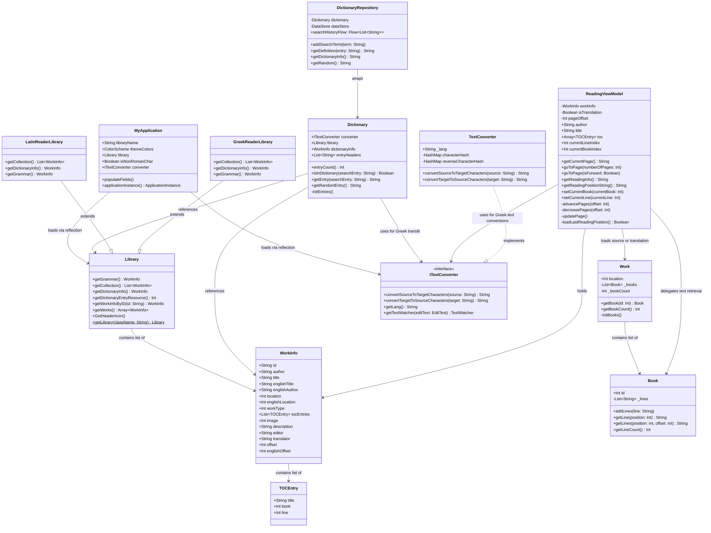

# Data Model & Processing Strategy

The `:core` module defines the domain models and data processing logic for Classics Reader. Since text databases (like full epics or lexicons) are quite large, the core module implements a lazy-loading strategy to prevent high memory utilization on startup.

## Domain Models

The following classes represent the core entities:

### `Library`
An abstract catalog coordinator. Each flavor subclasses `Library` (e.g., `LatinReaderLibrary` and `GreekReaderLibrary`) to define the exact collection of texts (`WorkInfo` array), grammar reference material, and dictionary resources. It provides helper methods to find a work by its ID.

### `WorkInfo`
A data-holding container containing metadata for a text. It stores bibliographical records (author, title, editor, translator, offset parameters) and raw resource IDs (`location` and `englishLocation` pointing to raw XML resources). It also stores an list of `TOCEntry` markers.

### `TOCEntry`
Represents a Table of Contents index coordinate, mapping a localized text name (e.g., "Book 1" or "COMMENTARIUS SECUNDUS") to a specific book number (0-indexed) and line offset (0-indexed).

### `Work`
An active text coordinator class. Initiated with a resource location ID, it parses the resource to identify the total book count, keeping an array of `Book` references. Books are lazily instantiated and parsed only when requested by the user.

### `Book`
Represents a major section inside a work (e.g., a "Book" or "Chapter"). It holds the text line-by-line as a list of strings, providing helper methods to retrieve single lines or a contiguous sequence of lines based on requested offsets.

### `Dictionary` & `DictionaryRepository`
Manage lexicon entries:
* `Dictionary` parses entry key headers from resource files and searches the raw XML stream for matching keys to extract definitions.
* `DictionaryRepository` exposes this database via suspending functions (offloading heavy file I/O to `Dispatchers.IO` threads) and wraps search history logging via Jetpack DataStore preferences.

### `ReadingViewModel` (Core Class)
A presentation-agnostic coordinator that manages active reader state. It calculates reading offsets, handles page-forward/backward increments, navigates via Table of Contents, and saves the user's progress to SharedPreferences.

---

## UML Class Relationships Diagram

The relationships and interactions of these classes are mapped below:



---

## Text Storage and Parsing Strategy

Ancient texts are stored as custom XML documents within raw resource files (e.g. `res/raw/caes_bg_lat.xml`). 

### XML Schema Layout
```xml
<work>
  <header>
    <title>De Bello Gallico</title>
    <author>C. Julius Caesar</author>
  </header>
  <text>
    <body>
      <div1 type="Book" n="1">
        <p>
          <milestone n="1" unit="chapter"/>
          <milestone n="1" unit="section"/>Gallia est omnis divisa in partes tres...
        </p>
      </div1>
    </body>
  </text>
</work>
```

### Parser Workflow (`ResourceHelpers.kt`)
1. **Count Books**: On first initialization, `Work` calls `getBookCount(stream)`. `ResourceHelpers` initializes a custom `XmlPullParser` via `initParser` (which disables namespace processing and document type declarations to maximize performance). It loops through the document and increments a counter for every tag matching `<div1>`.
2. **Lazy Book Extraction**: When the user requests a specific book (e.g. Book index 2), `Work` calls `getBook(2, stream)`. The parser skips prior `<div1>` nodes until it hits the target index, parses child `<p>` tags via `parseLines`, strips out milestone markup elements, and returns a fully populated `Book` object containing the raw text strings.
3. **Regex Cleanup**: Whitespace normalizations and extraneous character cleanups are applied to character lists inside `removeExtraneousCharacters` using regex match patterns.

---

## State & Persistent Settings Management

Classics Reader uses a hybrid approach to save settings and session states:

1. **Legacy SharedPreferences**: Used for storing reading progress coordinates. The `ReadingViewModel` saves a string format `currentBookIndex,currentLineIndex` under the key of the work ID (e.g., `"CaesarBG"` -> `"0,125"`) inside standard SharedPreferences. This is fast and synchronized synchronously during page-turning events.
2. **Jetpack DataStore (Preferences)**: Used in Compose and search modules. The search history logs and general user settings (text size, maximum poem lines displayed, show page controls flag, display type/mode) are saved using Jetpack DataStore. 
   * DataStore offers a non-blocking API utilizing Kotlin Coroutines and Flows (`preferencesFlow()`), reducing the risk of UI-thread jank when reading preferences.
   * `SharedPreferencesMigration` is implemented in Compose's `MainActivity` to migrate settings seamlessly from the old storage model.
