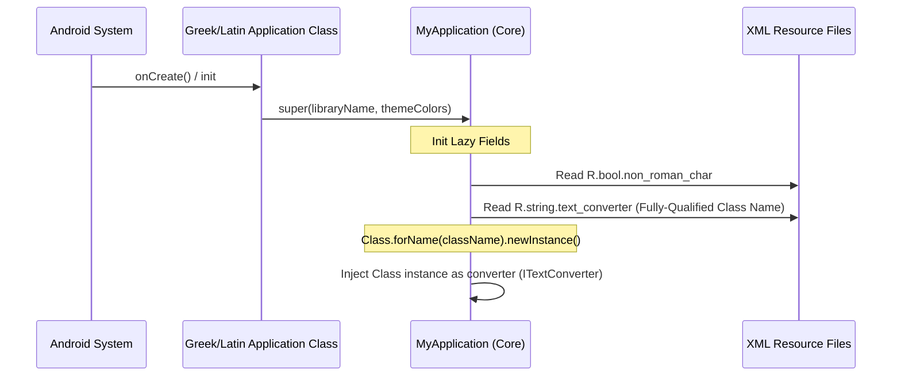

# Language Customization & Flavor Comparison

The Classics Reader architecture separates the common application structures from the target language configurations. This allows the codebase to compile two distinct applications—**Latin Reader** and **Greek Reader**—using a shared base structure.

---

## Technical Comparison Matrix

| Feature / Config | Latin Reader (`:latinreader`) | Greek Reader (`:greekreader`) |
| :--- | :--- | :--- |
| **Application ID** | `com.ericmschmidt.latinreader` | `com.ericmschmidt.greekreader` |
| **Non-Roman Script Support**| No (Uses standard Latin alphabet) | Yes (Uses Polytonic Greek alphabet) |
| **Orthography Translation** | None required | `TextConverter` (Latin-to-Greek transliteration) |
| **Integrated Dictionary** | An Elementary Latin Dictionary (Lewis) | An Intermediate Greek-English Lexicon (Liddell & Scott) |
| **Integrated Grammar** | Allen & Greenough's New Latin Grammar | Smyth's Greek Grammar for Colleges |
| **UI Theme Colors** | Warm Crimson / Rust palette | Deep Olive / Mediterranean Blue palette |

---

## Dynamic Dependency Injection via Reflection

To keep the `:core` and presentation modules (`:views`, `:compose`) completely decoupled from language-specific configurations, the base application class uses Java reflection.



### Reflection Implementation inside `MyApplication.kt`
* **Injecting the Catalog**: `MyApplication` takes a string name representing the library class (e.g., `"com.ericmschmidt.latin.data.LatinReaderLibrary"`). When the library is accessed, it loads the class using `Class.forName(libraryName)` and instantiates it dynamically:
  ```kotlin
  fun getLibrary(className: String): Library? {
      val libraryClass = Class.forName(className)
      val constructors = libraryClass.constructors
      return constructors[0]!!.newInstance() as Library
  }
  ```
* **Injecting the Transliteration Engine**: If `R.bool.non_roman_char` is configured as true in the XML resource file, the application queries `R.string.text_converter` to load the text converter class (e.g., `"com.ericmschmidt.greekreader.utilities.TextConverter"`). This allows the base core module to support polytonic conversions on demand without holding hardcoded references to the Greek converter module.

---

## Greek Polytonic Transliteration Engine (`TextConverter`)

Polytonic Ancient Greek includes many diacritical combinations (breathing marks, accents, iota subscripts) that are difficult to type using a standard mobile keyboard. `:greekreader` implements a custom `TextConverter` (implementing `ITextConverter`) to solve this.

### 1. Key features of the Transliteration Engine
* **Latin Keyboard Mapping**: Maps standard Latin keystrokes to Greek polytonic characters. Users can type in Roman characters, and the app translates the text in real time.
* **JSON Mapping Database**: Loads character conversion pairings from raw JSON resource file `R.raw.latin_greek_text_conversion`.
* **Automatic Final Sigma Selection**: Standard lowercase sigma (`σ`) is used within words, but if a word ends in sigma, the engine automatically replaces it with the terminal final sigma (`ς`). It also checks if the character is followed by punctuation marks (`:`, `;`, `'`, `.`, `\n`) to apply final sigmas correctly.

### 2. Diacritical Resolution Logic
Keystroke combinations are resolved chronologically to build complex Greek characters:
* An asterisk (`*`) indicates a capital letter.
* Character codes representing accents or breathing marks are combined with preceding vowels:
  * `)` represents a smooth breathing mark.
  * `(` represents a rough breathing mark.
  * `/` represents an acute accent.
  * `\` represents a grave accent.
  * `=` represents a circumflex.
  * `+` represents a dieresis.
  * `|` represents an iota subscript.
* For example, typing `*a)` transforms into capital Alpha with smooth breathing (`Ἀ`), and typing `a)/` transforms into lowercase alpha with smooth breathing and acute accent (`ἄ`).
